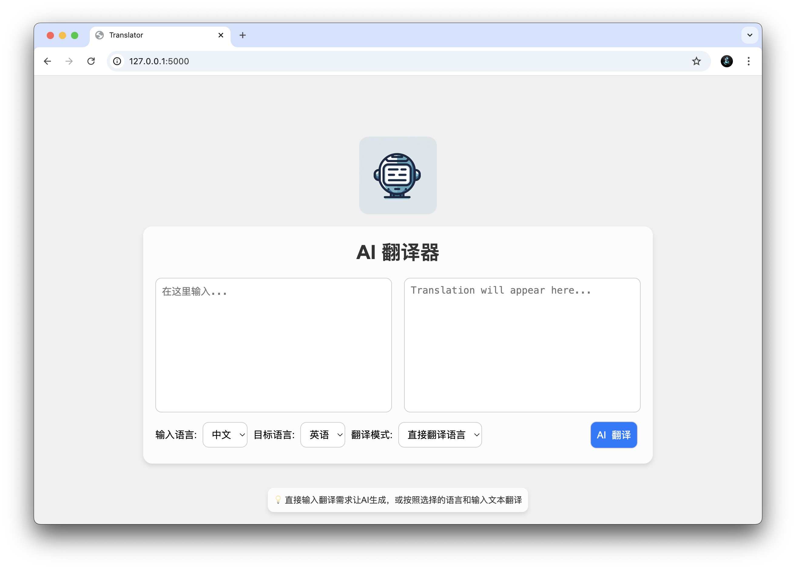

# AI_Translator
For Shengteng AI Competition, to build a embedded AI software

1. Artificial intelligence from Qwen:0.5b model, run by ollama in originpai.
2. Desigen a multiple input translator, user can input their needs or only translate text.
3. Use Flask frame to handle connection and message between broswer and server。

